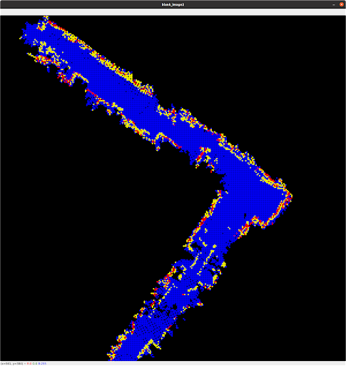
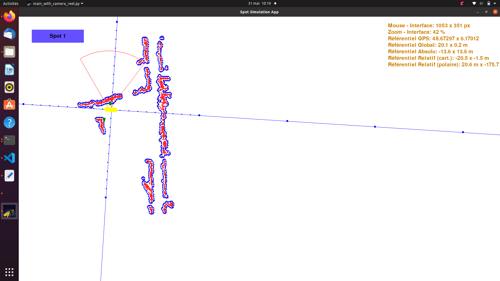

# Projet industriel ANDRA

* Encadrants :
   * Loïck BRIOT
   * Quentin HELAINE
   * Laurent CIARLETTA

* Etudiants :
   * Pierre QUEBRIAC
   * Julien JEANJACQUOT
   * Nicolas JABOULAY 

## Le projet

Ce projet en partenariat avec l'ANDRA s'inscrit dans le contexte du projet CIGEO. Le projet CIGEO est le projet français d'enfouissement en profondeur des déchets nucléaires. Depuis 1991 des études sont menées dans un laboratoire souterrain situé près de la commune de Bure dans le Grand-Est.
C'est dans ce laboratoire que notre projet doit trouver son application. 

Prendre des mesures de convergence de roche et de surveillance des éboulement post-creusement ne peux se faire régulièrement et aisément avec du personnel humain. En effet, par sécurité et praticité, les mesures sont à prendre la nuit pour éviter que les travaux journaliers ne perturbent les capteurs.
La solution que nous avons proposé s'appuie sur le robot SPOT de Boston Dynamics. Nous avons ajouter au cour du projet une couche haut-niveau de contrôle et d'autonomie au robot afin qu'il puisse mener aisément ses missions de ronde et de mesure.

Différents défis techniques se sont dressés face à nous, le premier étant de situer le robot dans son environement sans GPS, nous avons implémenté un algorithme de SLAM. Le second défi fut de pouvoir donner facilement des missions complexes (ronde, stop and go pour prendre des mesures) au robot. Nous avons pour cela développé une interface de contrôle.

## SLAM (Simultaneous Localisation And Mapping)

Le robot étant amené à effectuer des patrouilles dans les galeries, une solution de localisation et de cartographie en temps réel a été implémenté sur le robot SPOT (Algorithme de SLAM). Ainsi le robot est capable de produire une carte des lieux dans lesquels il se déplace et de s'y repérer.

*Capture d'écran de la carte d'une partie de galerie produite par SPOT*

## L'application

L'application développée pendant l'année permettra aux opérateurs de superviser SPOT lors de ses déplacements dans les galeries, en permettant notamment de localiser le robot et de le controler depuis un poste de contrôle à la surface en temps réel. Elle permet également de lui donner des missions prédefinies.

*Capture d'écran de l'application : les murs en rouge et bleu, SPOT en jaune et en vert les codes QR permettant de replacer le robot sur la carte*
