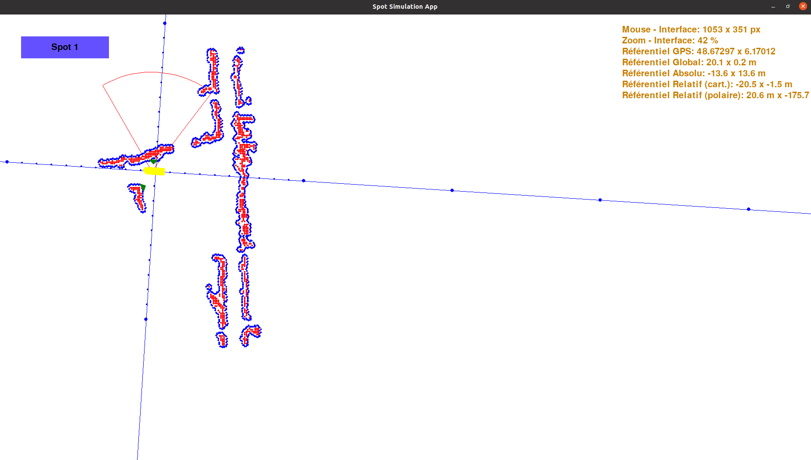

# Projet industriel ANDRA

* Encadrants :
   * Loïck BRIOT
   * Quentin HELAINE
   * Laurent CIARLETTA

* Etudiants :
   * Pierre QUEBRIAC
   * Julien JEANJACQUOT
   * Nicolas JABOULAY 

## Le projet

Ce projet industriel s'inscrit dans la continuité du projet français d'enfouissement des déchets radioactifs : Le projet CIGEO, en partenariat avec l'ANDRA (Agence national pour la gestion des déchets radioactifs). Le but étant d'utiliser le robot SPOT (Boston Dynamics), pour mener des études dans les galeries souterraines de leur site de recherche à Bure en y effectuant des rondes régulières pendant la nuit, lorsque les travailleurs ne sont pas sur place.

Différentes solutions ont donc été développé afin de répondre à ces besoins :

## SLAM (Simultaneous Localisation And Mapping)

Le robot étant amené à effectuer des patrouilles dans les galeries, une solution de localisation et de cartographie en temps réel à été implémenté sur le robot SPOT (la technologie SLAM). Ainsi le robot est capable de produire une carte des lieux dans lesquels il se déplace et de s'y repérer.

## L'application

L'application développée pendant l'année permettra aux opérateurs de superviser SPOT lors de ses déplacements dans les galeries, en permettant notamment de localiser le robot et de le controler depuis un poste de contrôle à la surface en temps réel.

