<div align="center">


# Documentation Installation et Configuration du SpotCore


</div>

<h1 align="center">
<br>
<br>

<br>
<br>
</h1>
<br>

Ce ReadMe contient toutes les informations pour :

- Installer Ubuntu 20.04 sur SpotCore
- Installer les paquets, logiciels, et dépendances nécessaires au fonctionnement des applications de SPOT

<br>


## Encadrants
 
* **Loïck Briot** 
* **Quentin Hélaine** 
* **Pascal Vaxivière**

<br>

## Installation de Ubuntu 20.04 sur SpotCore
---

Dans cette section, nous allons installer et configurer l'OS Ubuntu 20.04 sur le SpotCore à partir d'une clé USB contenant l'image Ubuntu.

* Connecter un écran, une souris, un clavier et la clé USB contenant l'image Ubuntu au SpotCore.

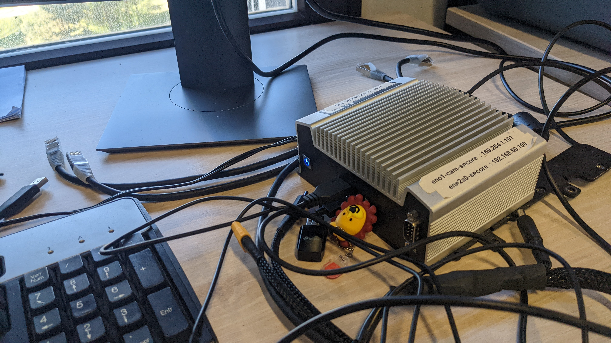

* Démarrer le SpotCore et appuyer sur la touche delete du clavier jusqu'à accéder au BIOS (voir ci-dessous). Cela va nous permettre de booter sur la clé USB.

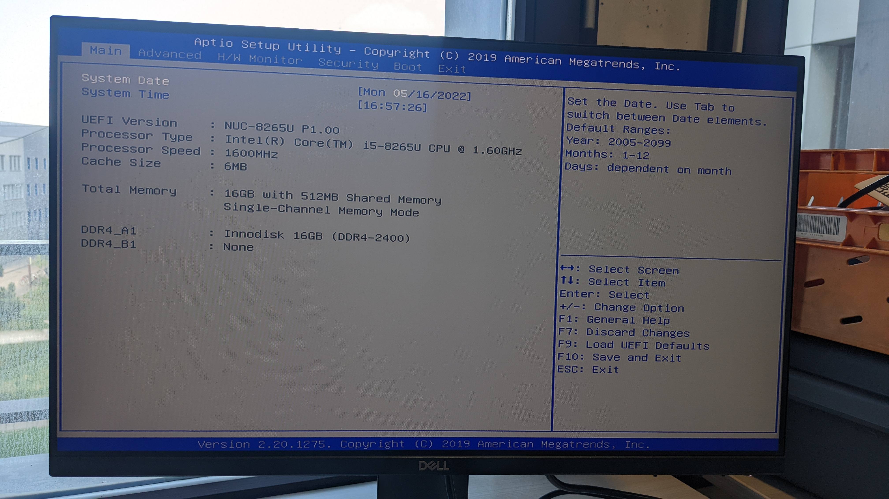

* Dans l'onglet **Boot**, sélectionner **Boot Option #1** à l'aide des flèches directionnelles et appuyer sur Entrée. Sélectionner **UEFI: General UDisk 5.00** dans le menu et appuyer sur Entrée.

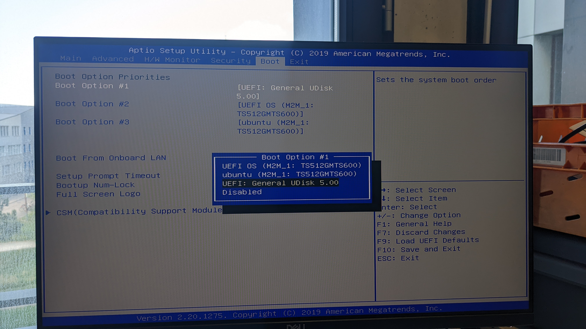

* Aller dans l'onglet **Exit** et selectionner **Save Changes and Exit**. Confirmer en appuyant sur Entrée.


* Après quelques secondes l'installation d'Ubuntu devrait se lancer.

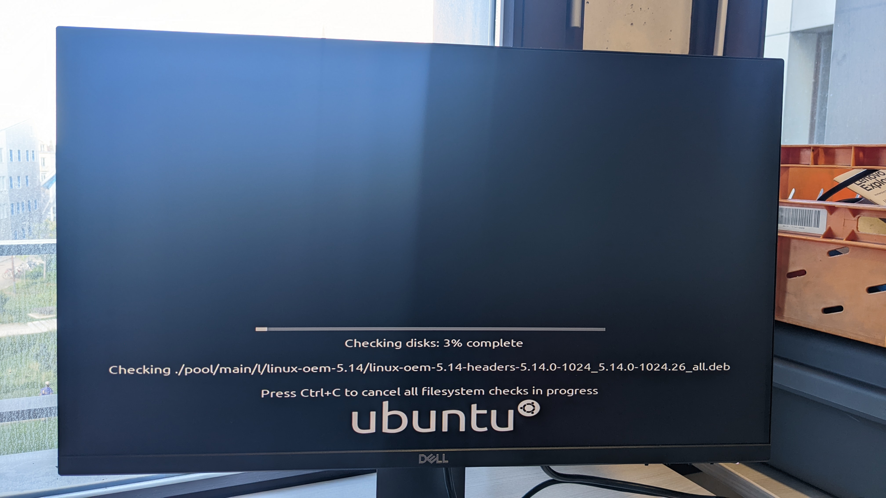

* Une fois terminé vous devriez tomber sur l'écran d'installation d'Ubuntu.

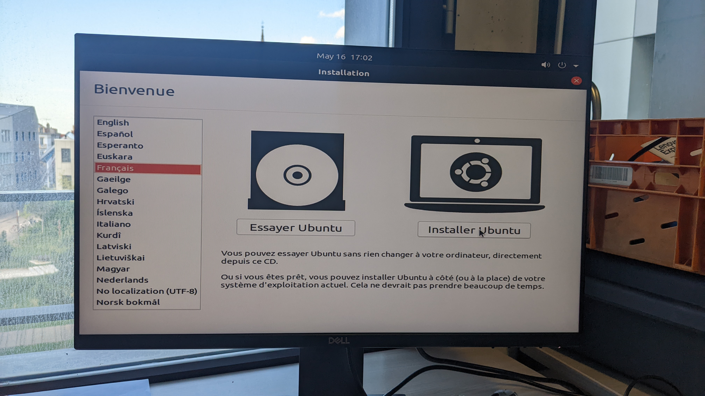

* Cliquer sur **Installer Ubuntu** et sélectionner la disposition du clavier comme indiqué ci-dessous.

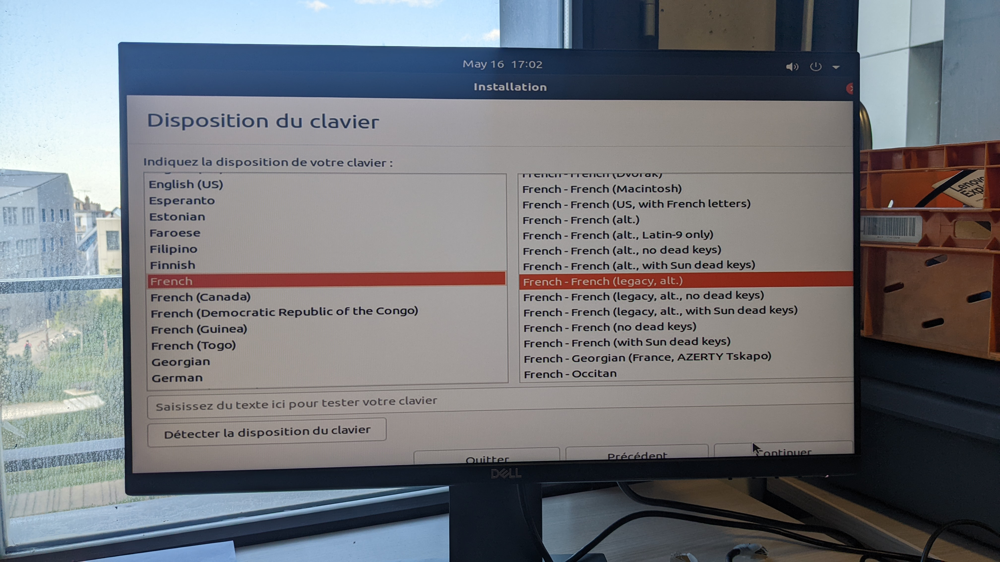

* Sélectionner **Supprimer Ubuntu 20.04 LTS et réinstaller** puis confirmer en cliquant sur **Continuer**


* Sélectionner la localisation


* Et renseigner les informations correspondantes puis valider.

* L'installation devrait se lancer :

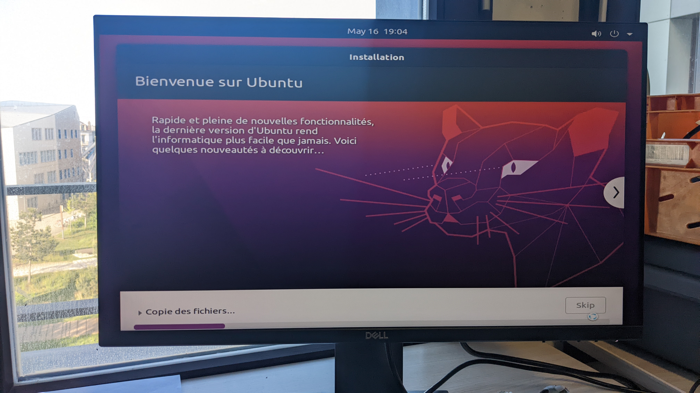

* Une fois l'installation terminée cliquer sur **Redémarrer maintenant**

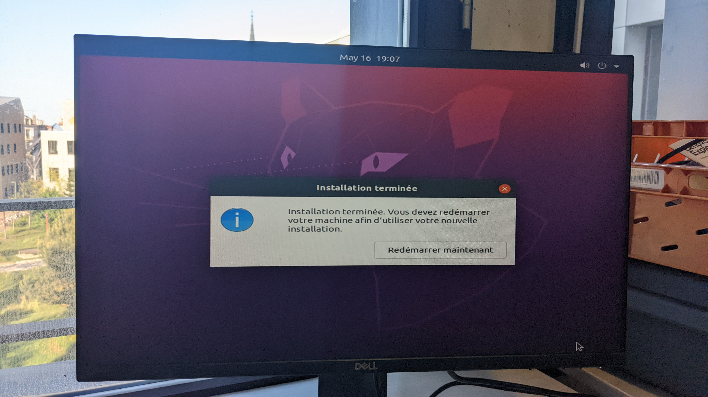

* Après redémarrage, vous devriez attérir sur le menu d'authentification d'Ubuntu. Ubuntu s'est bien installé !

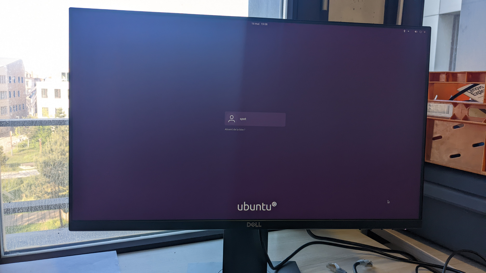

* Après authentification, mettre à jour les paquets installés par défaut en exécutant les commandes suivantes dans un terminal (Ctrl + Alt + T)

```
sudo apt update
sudo apt upgrade
sudo apt dist-upgrade
```

<br>

## Installation des pilotes pour clé Wi-Fi
---

SpotCore ne peut se connecter à un réseau Wi-Fi que par l'intermédiaire d'une clé Wi-Fi. Dans cette section nous allons installer les drivers nécessaires au fonctionnement de la clé Wi-Fi **TP-Link Archer T3U** sur SpotCore.

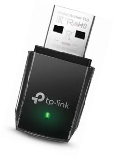
<br>
<br>

* Ouvrir un terminal de commande (Ctrl + Alt + T) et exécuter les commandes suivantes :

```
cd /home/spot
git clone https://github.com/cilynx/rtl88x2bu.git
cd rtl88x2bu
VER=$(sed -n 's/\PACKAGE_VERSION="\(.*\)"/\1/p' dkms.conf)
sudo rsync -rvhP ./ /usr/src/rtl88x2bu-${VER}
sudo dkms add -m rtl88x2bu -v ${VER}
sudo dkms build -m rtl88x2bu -v ${VER}
sudo dkms install -m rtl88x2bu -v ${VER}
sudo modprobe 88x2bu
```

* Brancher la clé et vérifier que SpotCore peut maintenant se connecter à un réseau en Wi-Fi

<br>

## Installation des paquets
---

Dans cette section nous allons installer les paquets nécessaires à nos applications sur SpotCore.

* Ouvrir un terminal de commande (Ctrl + Alt + T) et exécuter les commandes suivantes :

```
sudo apt-get install git linux-headers-generic build-essential dkms
sudo apt install git -y
sudo apt install nano
sudo apt -y install pkg-config
sudo apt -y install libssl-dev
sudo apt -y install libibverbs-dev
sudo apt -y install cmake
sudo apt -y install python3-dev
sudo apt -y install python3-pip
sudo apt install gnome-tweak-tool -y
sudo apt install curl -y
sudo apt install wget -y
sudo apt install apt-transport-https -y
sudo apt install ca-certificates -y
sudo apt install htop -y
sudo apt install gnupg-agent -y
sudo apt install software-properties-common -y
sudo apt install -y xvfb
sudo apt install -y openssh-server
sudo apt-get install portaudio19-dev -y
sudo apt install swig -y
sudo apt install tesseract-ocr -y
sudo apt-get install ninja-build -y
sudo apt install libsrtp2-dev -y
sudo apt-get install libzbar0 -y
sudo apt-get install -y libvpx-dev
sudo apt-get install libopus-dev
sudo apt -y install libavdevice-dev
sudo apt -y install libavfilter-dev
sudo apt -y install ffmpeg
sudo apt-get install ttf-mscorefonts-installer -y
sudo apt-get install libavformat-dev -y
sudo apt-get install libavdevice-dev -y
sudo apt-get install libavfilter-dev -y
sudo apt-get install freeglut3-dev -y 
sudo apt-get install libgtk2.0-dev pkg-config -y
sudo apt install -y libgconf-2-4 -y
sudo apt install default-jdk -y
sudo apt install v4l-utils -y
sudo apt install net-tools


sudo apt-key adv --keyserver keys.gnupg.net --recv-key F6E65AC044F831AC80A06380C8B3A55A6F3EFCDE || sudo apt-key adv --keyserver hkp://keyserver.ubuntu.com:80 --recv-key F6E65AC044F831AC80A06380C8B3A55A6F3EFCDE
sudo add-apt-repository "deb https://librealsense.intel.com/Debian/apt-repo $(lsb_release -cs) main" -u
sudo apt update
sudo apt-get install librealsense2-dkms -y
sudo apt-get install librealsense2-utils -y
sudo apt-get install librealsense2-dev
sudo apt-get install librealsense2-dbg
```

* Brancher une caméra RealSense à un port USB du SpotCore et vérifier que les commandes suivantes fonctionnent dans un terminal :

```
realsense-viewer
ffplay /dev/video4
```

<br>


## Installation des dépendances Python
---

Dans cette section nous allons installer les dépendances Python nécessaires au fonctionnement de nos applications de Spot à l'aide de pip3 (gestionnaire de librairies Python).

* Ouvrir un terminal de commande (Ctrl + Alt + T) et exécuter les commandes suivantes :

```
pip3 install --upgrade testresources
pip3 install --upgrade setuptools
pip3 install --upgrade pip
pip3 install torchaudio
pip3 install pillow
pip3 install scikit-build
pip3 install  scikit-learn
pip3 install ninja
pip3 install opencv-python
pip3 install pandas
pip3 install requests
pip3 install pyyaml
pip3 install tqdm
pip3 install matplotlib
pip3 install seaborn
pip3 install yacs
pip3 install pycocotools
pip3 install pytesseract
pip3 install zmq
pip3 install omegaconf
pip3 install pyaudio
pip3 install playsound
pip3 install pyzbar
pip3 install av
pip3 install yolov5
python3 -m pip install --upgrade bosdyn-client bosdyn-mission bosdyn-choreography-client
pip3 install pyglet
pip3 install shapely
pip3 install pyvirtualcam
pip3 install pyrealsense2
pip3 install mit_semseg
pip3 install aiortc
pip3 install selenium
pip3 install pyautogui
pip3 install dlib
pip3 install imutils
pip3 install pygame
pip3 install bitstring
pip3 install crc16
pip3 install dt_apriltags
```

<br>


## Copie locale des répertoires robot-simulation-app et spot-sdk et tests
---

Dans cette section nous allons récupérer les projets **robot-simulation-app** (application SPOT) et **spot-sdk** (ensemble de librairies de SPOT) qui se trouvent sur GitHub sur SpotCore.

* Ouvrir un terminal (Ctrl + Alt + T) et exécuter les commandes suivantes :

```
cd /home/spot
git clone https://github.com/mines-nancy/robot-simulation-app.git
cd robot-simulation-app/
git checkout slam2
cd /home/spot/robot-simulation-app/video/ai_models/utils/openpose/lib/pafprocess
swig -python -c++ pafprocess.i && python3 setup.py build_ext --inplace
```
```
cd /home/spot
git clone https://github.com/boston-dynamics/spot-sdk.git
```

On va maintenant procéder à des tests pour vérifier que les applications fonctionnent bien.

* Démarrer SPOT et se connecter à son réseau Wi-Fi

* Exécuter les commandes suivantes dans un terminal :

```
cd /home/spot/spot-sdk/python/examples/estop/
python3 estop_nogui.py [IP ROBOT]
```

```
cd /home/spot/robot-simulation-app
python3 interface/main_with_camera_reel.py --username [USER] --password [PASSWORD] [IP ROBOT]
```

<br>


## Installation de PyCharm Community
---

Dans cette section nous allons installer PyCharm Community par l'intermédiaire de ToolBox App, un gestionnaire d'environnements de développement (IDE) créé par JetBrains.

* Rendez-vous à l'adresse suivante __https://www.jetbrains.com/fr-fr/toolbox-app/__ et cliquer sur **Télécharger** pour télécharger le Toolbox App de JetBrains.

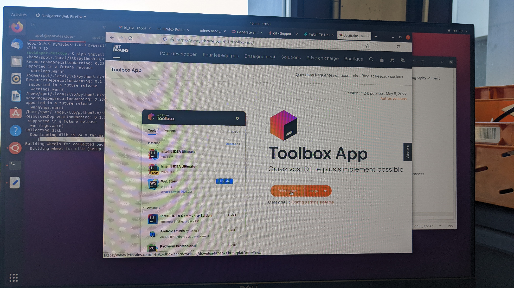

* Extraire les fichiers du dossier téléchargé dans le dossier **Téléchargements**.

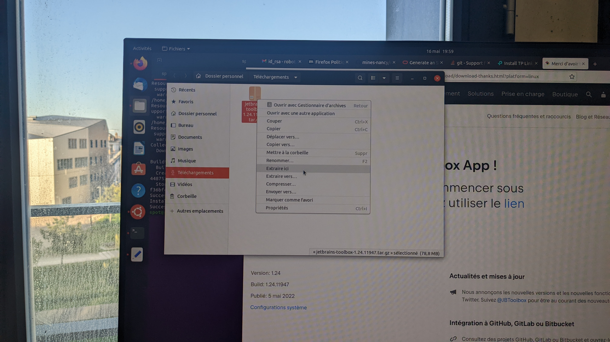

* A l'intérieur du dossier extrait se trouve un exécutable nommé **jetbrains-toolbox**.

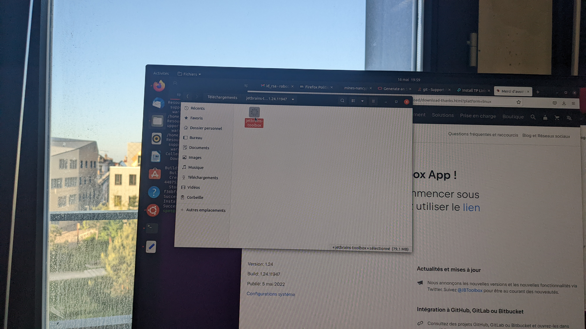

* Ouvrir un terminal de commande et se rendre à l'intérieur du dossier extrait avec la commande suivante :
```
cd Téléchargements/[nom_du_dossier_extrait]
``` 

* Taper ensuite la commande suivante pour exécuter le programme d'installation :
```
./jetbrains-toolbox
``` 

* Une fois l'installation terminé, JetBrains Toolbox devrait s'afficher dans le coin supérieur droit de l'écran.

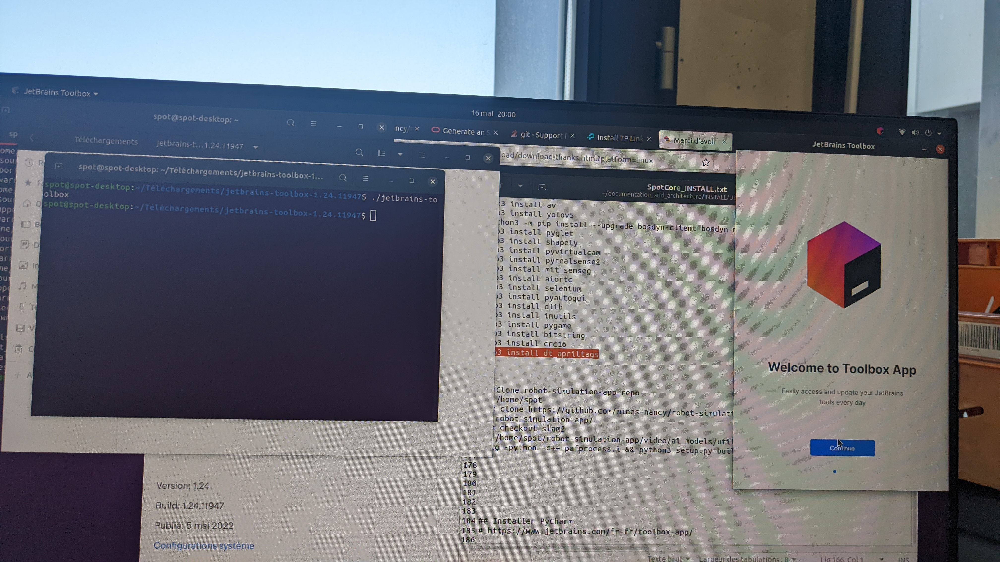

* Cliquer sur **Continue** et installer PyCharm Community en cliquant sur **"Install"** dans l'onglet **Tools**.


